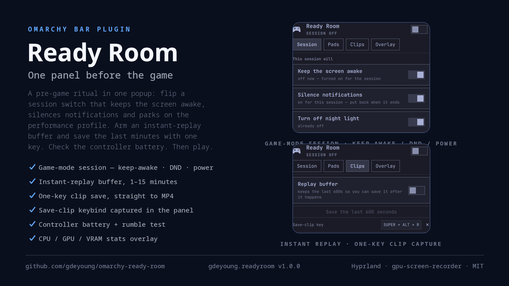

# Ready Room




The pre-game ritual in one Omarchy panel: a game-mode session, controller
care, instant replay and a stats overlay — instead of six bar widgets that
don't know about each other.

**gaming · game mode · session · controller · gamepad · battery · rumble ·
instant replay · replay buffer · clip capture · screen recording ·
gpu-screen-recorder · overlay · stats · FPS · MangoHud · Hyprland · Quickshell**

> **Status: v1.0.0.** All four tabs work; the save-clip keybind is set from the panel. Built and verified against a real
> Xbox One S on the `xone` driver, an Xbox Wireless Adapter, and
> gpu-screen-recorder 6.1.

## Install

```bash
omarchy plugin add https://github.com/gdeyoung/omarchy-ready-room.git --enable
```

## Uninstall

```bash
omarchy plugin remove gdeyoung.readyroom
```

That removes the plugin and its bar widget. Three things it may have left
outside its own directory, only if you used them:

- **The udev rule** — `sudo rm /etc/udev/rules.d/71-readyroom.rules && sudo udevadm control --reload-rules`
  (see `docs/UDEV.md`).
- **MangoHud settings** — delete the block from `### begin ready-room` to
  `### end ready-room` in `~/.config/MangoHud/MangoHud.conf`; everything else
  in that file is yours.
- **Saved clips** — in `Clips/` under your Videos folder (or under
  `$OMARCHY_SCREENRECORD_DIR` if you set it). They are yours to keep.

Session changes (stay-awake, do not disturb, night light, power profile) are
restored when a session ends, so end the session first
(`omarchy-shell -q readyroom sessionOff`) if you remove the plugin mid-game.

## What it does

**Session** — one switch for the things you flip before playing: keep awake, do
not disturb, night light, power profile. Ready Room only ever changes what it
owns: anything you'd already turned on yourself is left exactly as it was, and
restored state is never guessed. If another tool already holds the stay-awake
marker, the panel says so instead of fighting it.

**Pads** — connected controllers with battery, connection type and driver, a
rumble test, and a live input view. Controls that can't work on your hardware
are absent rather than dead: an Xbox pad on `xone` reports battery in five
levels and has no charging state, so that's what's drawn — no invented
percentages. There is no deadzone slider, because Linux Xbox pads have no
deadzone control; that lives in Steam Input or the game.

**Clips** — an instant-replay buffer, a save-the-last-N-seconds button, and your
recent clips. Saving is bound to a key, not to having the panel open:

```
omarchy-shell -q readyroom saveClip
```

**Overlay** — CPU, GPU, memory, VRAM, temperatures and GPU power in a corner of
whichever screen the game is on. Frame rate can only be counted from inside the
game's own process, so for FPS the tab can match MangoHud to the same corner and
metrics — only when you press the button, and only inside its own marked block
of `MangoHud.conf`, leaving the rest of your config alone.

Every tab's action is also an IPC call (`omarchy-shell -q readyroom status`
lists the state; `sessionToggle`, `replayToggle`, `overlayToggle` and friends
are in `Service.qml`), so any of them can go on a key.

## Roadmap

All five milestones are in:

| | |
|---|---|
| **M0** | Scaffold, service, panel, IPC |
| **M1** | Session toggles and the ownership model |
| **M2** | Replay arm / disarm / save |
| **M3** | Clip list and thumbnails |
| **M4** | Controller inventory, battery, rumble |
| **M5** | Live input view, guide LED, dongle pairing |

Next, roughly in order of usefulness: a game library with per-game profiles,
a drawn controller silhouette to replace the chip grid, and routing recording
and replay through one recorder instance rather than two.

## Requirements

Omarchy with the Quickshell shell, and `gpu-screen-recorder` for replay — which
Omarchy already ships. The controller tab reads evdev and sysfs directly through
`python3` using only the standard library, so live input, battery and rumble
need no extra packages and no root.

Optional, and the plugin says so in place when one is missing:

- `ffmpeg` — clip thumbnails; without it they fall back to a glyph.
- `mangohud` — frame rate in games; everything else in the overlay works
  without it.

Two Xbox controls — the guide-button light and pairing from the panel — are
root-owned and stay hidden unless you install the optional udev rule; the panel
offers to walk you through it. See `docs/UDEV.md`.

## Adding another controller

`docs/ADDING-A-CONTROLLER.md` is the procedure: identify the driver, measure
the buttons, declare the capabilities, draw the silhouette. Art is data in
`controllers/PadArt.js` and the renderer draws whatever parts a family
declares, so a pad with trackpads instead of a right stick needs no code.

The **Steam Controller (2015)** has been checked against a real wired pad:
every button and axis matches `docs/STEAM-CONTROLLER.md`. When Steam or a Proton
game takes it over, the panel names the program holding it instead of calling it
disconnected. The silhouette and axis directions are still unverified — that doc
says what to check.

## Development

The repository *is* the plugin directory — `omarchy plugin validate` rejects
symlinks, so there's no second copy to keep in sync.

```bash
git clone https://github.com/gdeyoung/omarchy-ready-room.git \
  ~/.config/omarchy/plugins/gdeyoung.readyroom
omarchy plugin validate ~/.config/omarchy/plugins/gdeyoung.readyroom
journalctl --user -t omarchy-shell -f    # QML errors land here
```

Saving a file hot-reloads it. A *newly created* file needs
`omarchy-restart-shell` — until then the shell reports errors from a stale
compile, at line numbers that no longer exist. `docs/DECISIONS.md` records that
and the other behaviour this plugin is built on.

## Licence

MIT. See `THIRD_PARTY_NOTICES.md` for design lineage — the community plugins
this one learned from, none of which it depends on at runtime.
